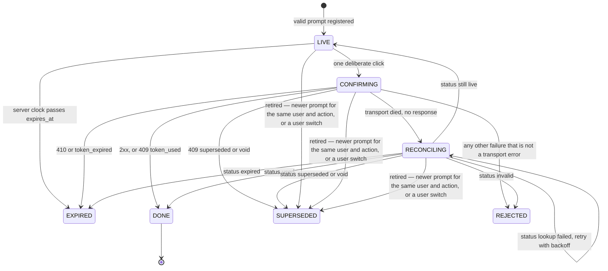

# Sofra client

React + TypeScript client for the Sofra assistant. It speaks the contract in the repository README and does not modify `mock-server/`, `data/`, `schema/`, `scripts/`, or `scenarios.jsonl`.

The mock is the source of truth for money, eligibility, and whether an action ran. This client streams UI, refuses to draw anything it cannot validate, and treats confirmation as a state machine that can fire at most once.

## Demo (rows 4–9)

Screen recordings of the confirmation lifecycle. Folder is shared “anyone with the link”.

- All: [Sofra confirmation demo (rows 4–9)](https://drive.google.com/drive/folders/19LArOO-YnvpztTT6eHrAifIyHtDiIynX?usp=drive_link)
- 4–5 place order and confirm: [folder](https://drive.google.com/drive/folders/1CxEDJYVh72lx68qCSyunzln8qXMbrMHT?usp=drive_link)
- 6 double-click, single execute: [folder](https://drive.google.com/drive/folders/18GbAuUiIfAaiwEY8l574eOOAFYcFI2GT?usp=drive_link)
- 7 supersede (“make it 5”): [folder](https://drive.google.com/drive/folders/1PEm4oY4N_lJRKEW6RP0vNPGnNMHFJScP?usp=drive_link)
- 8 short TTL expiry: [folder](https://drive.google.com/drive/folders/1Lq-kgU-Jx4lxB97nHZo0RPB5I7xgKuNG?usp=drive_link)
- 9 tip + drop execute, reconcile: [folder](https://drive.google.com/drive/folders/1gegT3tIDtNTGjuQU3HYPkEX-mObM_NiZ?usp=drive_link)

## Run

From the repository root:

```bash
npm install --prefix client
```

Then two terminals:

```bash
npm start          # mock on http://localhost:4000
npm run client     # Vite on http://localhost:5173, proxies /api → :4000
```

All application code lives under `client/`. Root `package.json` only adds the `client` / `client:build` / `client:test` / `client:storybook` scripts next to the original `start` / `check` / `reset`.

From `client/`: `npm run dev`, `npm run build`, `npm run test`, `npm run lint`, `npm run storybook`.

Ledger rows stay manual. After a pass of a scenario row in the UI (mock already running):

```bash
npm run check -- sc_05    # ledger assertions for that row
npm run reset             # reset mock state
```

## Where the dangerous decisions live

A later change should have to get these wrong in one place, not in a component.

| Decision | Owner |
|---|---|
| Bytes become events, duplicates are dropped, a dead stream stays incomplete | `infrastructure/streaming` |
| A block is either trusted or absent | `domain/ui-spec` (Zod, `.strict()`) |
| A token may be executed, and only once | `domain/confirmation` |
| “Now” for expiry and “today” | `domain/clock`, fed by `server_now` and `X-Sofra-Now` |
| Markdown cannot navigate, fetch, or run | `security/markdown` |
| Wallet, cart, and orders refresh after a real execution | `ConfirmationProvider` invalidates the shell queries |

React renders the result of those decisions. It does not make them.

## Architecture

```
app            providers, shell layout
features       chat, confirmation UI, shell, audit inspector, help center, workbench
domain         ui-spec, confirmation store, server clock
infrastructure NDJSON session, fetch, execute/status
security       markdown policy
shared         user context, money formatting, primitives
```

UI lives under `features/`. Confirmation lifecycle, block validation, and the server clock live under `domain/`. Features depend on `domain`, `infrastructure`, `security`, and `shared`; domain does not import from infrastructure, features or React UI. The confirmation store declares the execute/status shapes it needs; `ConfirmationProvider` wires the HTTP client into them. A component can ask a store or a parse result; it should not invent eligibility, expiry, or “did this execute?”.

Four pieces of state, on purpose:

1. **Chat turns** live in `useChatController`. A turn is a user line plus an assistant record: transport status, trusted blocks, validation failures, and the parsed audit record. The transcript is not derived from the raw stream.
2. **Confirmations** live in a store outside React (`createConfirmationStore`), subscribed with `useSyncExternalStore`. The store is the only caller of `POST /api/actions/execute`. The button asks the store to confirm a token; it does not call fetch.
3. **The server clock** is a module anchor: the last server sample plus `performance.now()` elapsed since it arrived. REST re-anchors from `X-Sofra-Now`; a chat stream uses that response header (flushed when the body starts). `meta.server_now` is the same instant but arrives after the mock’s pre-body delay, so it is a fallback only when the header is missing — never re-applied per chunk. Expiry and relative dates never use `Date.now()`.
4. **The shell** (wallet, cart, orders) is React Query, keyed by user id. Chat blocks are not a cache of those resources. After a successful execute, or after status reconciliation says the token was used, the store’s `onDone` invalidates user, cart, and orders for that user. The header moves 800 → 410 without a reload because the shell refetches, not because the client subtracts.

The user switcher lists users from `GET /api/users`. The pill shows `display_name` as the server sends it, with a short persona label under it for the four case ids (Standard, Age unverified, Low balance, New user) and the server’s `district` for anyone else. The name comes from the detail query the header already fetched, or from the list while a fresh detail is still loading, so a switch never flashes a raw id (`resolvePersona`). The opening selection is `u_ok` until the reviewer picks another id.

Switching user remounts the chat (`ChatSessionProvider key={userId}`), clears `conversation_id`, and marks that user’s live prompts `SUPERSEDED`. The next message starts a new conversation. The old token is not confirmable (`sc_24`).

## Streaming and rendering

`POST /api/chat` returns `application/x-ndjson`. Chunks are not lines and are not characters.

```
Uint8Array
  → TextDecoder({ stream: true })     split code points stay in the decoder
  → line buffer                       a line split across chunks parses once
  → JSON.parse                        a bad line is dropped; the turn continues
  → applyStreamEvent                  first seq wins; later copies are ignored
  → AssembledStream                   slots filled by index; text_delta appends
  → parseBlockList (Zod)              trusted blocks + failure records
  → BlockRenderer                     switches on TrustedBlock['type']
```

`createStreamSession` gives each turn a generation. `abort()` or a newer `beginTurn()` bumps it. Pushes from the old reader return immediately, so a stopped or replaced stream cannot paint into the next turn. Stop aborts the `fetch`. Sending while a turn is in flight aborts it first and marks that assistant turn `stopped` (“Replaced by a newer message”).

`meta.version` other than `"1"` freezes the assembly as `unsupported_version`. Later events do not render. The user sees a plain refusal, not a half-drawn catalog from a contract we do not implement.

If the body ends while status is still `streaming`, the turn is `incomplete`: whatever arrived stays, with a retry. `drop_mid_stream` destroys the socket; the read throws and we take the same path. If bytes stop after the first chunk and the socket stays open, a 2.5s idle timer marks the turn incomplete (a client reading of “no `done`” when the socket never closes cleanly — see Assumptions).

HTTP failures never become a fake stream:

- **429** reads `Retry-After`, disables send until that window passes, then the user retries. We do not auto-retry.
- **500** is a final failure for that attempt, with a retry that starts a new request.
- A network failure before any body is retryable. A network failure after partial bytes is the incomplete turn above.

`conversation_id` from `meta` is stored and sent on later turns. Follow-ups (“make it 5 cheeseburgers”) only work inside that conversation.

Unknown block types (`map_view`) are skipped. The rest of the turn renders. There is no empty hole and no crash.

## Validation

Runtime validation is Zod, written against the v1 catalog in `domain/ui-spec/blockSchemas.ts`, not generated from `schema/`. Generation would track the file; hand-written schemas make the closed set and the fail-closed cases obvious in review. The cost is drift: a catalog change must be copied here. I would generate them in CI if this catalog kept moving (see below).

Rules, in order:

1. A value that is not an object with a string `type` is an invalid block. It is not drawn.
2. A `type` outside the catalog is `unknown_type`. It is skipped. Siblings still render.
3. A known type is parsed with a discriminated union of `.strict()` objects. Extra keys fail the block. Zod’s default is to strip unknown keys and continue; stripping would render a block we do not fully understand, which is the wrong failure mode next to a confirmation token.
4. A `confirmation_prompt` that fails (missing `expires_at`, wrong `action`, empty token, extra fields) sets `rejectedConfirmation` and is **not** registered with the store. No Confirm control exists for that token, even when the token would have executed on the server (`malformed_confirmation`).
5. Only a successful parse produces a `TrustedBlock`. `BlockRenderer`’s switch is exhaustive on that union. The component cannot receive the raw JSON.

Empty index slots (a `text_delta` or a hole before its `block`) are dropped before this parse. Prices, fees, and `meets_minimum` are displayed as sent. The client does not add line items or invent a delivery fee.

Audit follows the schema too, and the schema leaves it open (no `additionalProperties: false`), so unknown audit keys are stripped rather than rejected; a wrong `decision` still fails. A structurally invalid audit is omitted from the inspector; it does not sink the blocks that already validated. Validation failures for the turn are listed beside the audit record.

## Confirmation lifecycle

States: `LIVE → CONFIRMING → DONE`, the transient `RECONCILING`, and the exits `EXPIRED`, `SUPERSEDED`, `REJECTED`.



Exactly once:

- `confirm()` returns immediately if the token is already in `inFlight` or not `LIVE`. A double click, a triple click, or a held activation cannot start a second `execute`.
- The Confirm control is `<button type="button">`. It is not focused when the prompt appears. Enter in the composer submits the form that sends a chat message. The hint under the composer says so. There is no path from that key to `confirm()`.
- A newer prompt for the same user and action marks older `LIVE` / `CONFIRMING` / `RECONCILING` entries `SUPERSEDED` before the new one is stored. The old button disables. The ledger should show zero attempts with the old token.
- `token_used` (409 after a duplicate that still raced) is `DONE`, not an error. The UI does not say “already used” after a success.
- A dropped execute response is `TransportError`. The store reconciles with `GET /api/actions/status` and does not ask for a second approval. `used` becomes `DONE` and renders `nextBlocks` from the status result, so a tip that actually landed is shown as landed (`drop_execute_response`). If the status lookup itself fails, it is retried with backoff (1s, 2s, 4s, 8s, then every 10s) and the card says when the next check runs. Status reads are safe to repeat; execute is never repeated. The retry loop stops as soon as the prompt is retired locally (superseded, user switch).
- A 410 body can carry a fresh `confirmation_prompt`. Follow-up prompts inside a parsed execute body are registered. The expired card stays inert; the new one is the only live control.
- Expiry uses the server clock (1s tick + again at `confirm()`). Without a clock sample, `canStartConfirm` is false.

The card stays on screen after `DONE` (“Confirmed”) and renders the execute `nextBlocks` under it. `cancel_order` uses a destructive treatment (copy, border) so it is not the same object as place-order. A `verification_gate` is a different component: “Blocked — nothing executed”, no confirm control, requirement shown as text rather than colour.

There is no decline control: the contract cannot void a live token, and a client-only dismiss would only hide it. Not confirming is the decline until expiry or supersession (proposed `void` endpoint below).

## Untrusted content

`text.markdown` is model output that quotes user-controlled data. `order_summary.note` is a customer string. Neither is HTML.

| Surface | Policy |
|---|---|
| Assistant markdown | `react-markdown` with **no** `rehype-raw`. HTML in the source stays text. |
| Links | `urlTransform` allowlist: `http:`, `https:`, `mailto:` only. `javascript:` and `data:` become non-links. `http(s)` opens in a new tab with `rel="noopener noreferrer"`. |
| Images | Custom `img` renderer. The URL is never requested. The user sees an alt-text stub. |
| Order notes | React text children in the chat card and in the orders panel. Not passed through markdown. |

`react-markdown` will pass raw HTML through if `rehype-raw` is added later. It is not a dependency, and the image override ignores `src` so a future default change does not start fetching. `sc_17` (`html_in_note`, `javascript_link`, `remote_image`) is required to leave `security_beacons === 0`.

Suggested-action chips only call `send()` with the chip string. They cannot execute an action. The cart’s **Place order** button is the same kind of control: it sends a chat message, and it is disabled while a turn is in flight or while that user already has a `LIVE` / `CONFIRMING` / `RECONCILING` prompt, so the shell cannot stack a second live token next to one the user has not answered.

## Accessibility

Keyboard-only is the default path, not a later pass (`sc_23`).

- Skip link moves focus to the composer. Interactive controls use a `:focus-visible` ring.
- Confirm is in tab order and is never auto-focused.
- Gate, confirm, done, expired, replaced, and error each have a text label. Status is also border style (solid / dashed / dotted), not hue alone.
- A gate is `role="status"` with an explicit “nothing executed” label.
- Streaming text is one markdown block that grows. We do not announce each token. An empty text block reserves a “Thinking…” line so the layout does not jump when the first delta arrives.
- Money uses `tr-TR` / TRY formatting. Display strings that we case-fold use a locale (`en-US` on the status badge) so a Turkish `i` is not destroyed by a default `toUpperCase()`.
- When a stream leaves `loading` / `streaming`, a single `aria-live="polite"` announcement fires (`settleAnnouncement`), including action, total, and initial expiry. The visible countdown is not a live region — ticking every second would drown the settle message and the reply.

## Screen-reader notes (rows 4–5)

What VoiceOver / NVDA should hear, in order:

**Row 4** — “Order 2 cheeseburgers from Burger Stop”

1. Composer focus stays put; Confirm is not auto-focused.
2. While bytes arrive, the text block is busy (“Thinking…”), not a live region that speaks every token.
3. When the turn settles: one polite announcement — `Reply ready. Confirmation required: place order, total ₺390, expires in 4:59.`
4. Moving to the confirmation region: `Confirmation required, Place order, total ₺390`.
5. The countdown is on-screen; it is read when the user reaches that text, not re-spoken every second. Enter in the composer still sends chat, not confirm.

**Row 5** — Confirm on the card

1. Activate Confirm (tab to the button, then Space/Enter).
2. One polite outcome announcement when the store reaches a terminal state — e.g. `Confirmed. Your order was placed.` (also expired / replaced / unavailable). Ordinary chat lines are not auto-read.
3. Status copy moves to Confirmed; the region name tracks the status kicker.
4. Wallet refresh is visual in the header; no second “already used” error after `token_used`.

## Phone layout

Below 720px the composition flips: chat is the full viewport, Cart / Orders / Audit become a bottom nav, and the active shell panel opens as a bottom sheet. Dismiss by tapping the dimmed area, pressing Escape, or tapping the same tab again. Desktop keeps the three-column rail + sidebar + chat. Safe-area insets are respected on notched devices.

## Performance

The transcript is not virtualised. Scenario-length chats stay fine; hundreds of block-heavy turns would want windowing before anything else. Streaming cost is mostly layout, not parse: bytes assemble outside React, Zod runs on settled slots, and an empty text block keeps a “Thinking…” row so the first `text_delta` does not shove the composer. We do not re-announce every token. Production build is ~543 kB JS (~163 kB gzip) plus ~50 kB CSS (~9 kB gzip); most of the JS is React + `react-markdown`. If the catalog grew, lazy-loading the markdown path and the audit inspector would be the first cuts.

## Audit inspector

Every assistant turn keeps `decision`, `reason`, `intent`, `tools_called`, `kb_doc_ids`, the request id, the turn status, and per-block validation failures, including rejected confirmations.

The inspector is the sidebar “Audit” section, for the reviewer. The product transcript does not repeat `audit.decision`. The user already sees the outcome: a gate, a confirmation card, or ordinary text. Putting `blocked` / `unknown` / `clarify` in the bubble would leak protocol vocabulary and compete with the block that already explains the situation. Row 18’s “I don’t know” stays a normal answer in chat; the inspector is where `unknown` vs `answered` (and `pol_delivery_fee_v2`) is visible.

## Sources

`audit.kb_doc_ids` render as citations in Audit (primary source first). Clicking one loads `GET /api/kb/:id` into a dialog. The KB has no `archived` field, so the dialog surfaces soft trust hints from tags (`archive`), titles (`(legacy)`, “archive”), id suffixes (`_old`, `_v0`), or a missing date — without inventing policy.

## Component workbench

Storybook shows every catalog block in the states the transcript can reach, including ones that must not render. It does not call the mock. Confirmation cards use a seeded wallet (₺800) and cart so the prompt looks the way it does in chat. Invalid payloads go through the same Zod parser as the app: the transcript pane is only trusted blocks, and the validator pane is the failure.

```bash
npm run client:storybook   # http://localhost:6006
```

Open **Blocks → All** under each group. **Invalid** is the fail-closed set: unknown `map_view`, `price_try: "195 TL"`, a confirmation missing `expires_at`, empty slots, and a `version: "2"` document.

## Help center

The shell **Help** tab searches `GET /api/kb/search` (paginated). Results reuse the same trust badges and document dialog as Sources. Try `delivery fee` (current vs archived) or `istanbul` (Turkish fold). Chat scenarios are untouched — Help is a parallel shell panel.

## Assumptions

- The spec wins if it and the mock disagree. Chaos modes follow the README, not mock-only quirks.
- The 2.5s idle cutoff covers a stream that stops without `done` and without a clean close; a clean close takes the incomplete path immediately.
- `token_used` is success — showing an error would punish a duplicate we already tried to prevent.
- 429 is user-paced; auto-retry would hide the `Retry-After` window.
- Relative dates use the server’s Europe/Istanbul calendar day, not the browser timezone.

## Tests

The tests pin the behaviours that move money or paint the wrong turn. They are not snapshots.

| Area | File | What is pinned |
|---|---|---|
| Stream | `infrastructure/streaming/streamEngine.test.ts`, `infrastructure/api/apiClient.test.ts` | Split UTF-8, split lines, duplicate `seq`, missing `done`, error/`retryable`, abort and supersede leak nothing into the next turn |
| Confirmation | `domain/confirmation/confirmationStore.test.ts` | Single in-flight execute, expiry by server clock, supersede, transport failure reconciles without a second execute (a failing status lookup is retried, and stops on user switch), invalid prompt never registers, `onDone` for shell refresh |
| Blocks | `domain/ui-spec/uiSpec.test.ts` | Unknown skipped, invalid not rendered, malformed confirmation fail-closed |
| Markdown | `security/markdown/SafeMarkdown.test.tsx` | HTML inert, `javascript:` not a link, image `src` not fetched |
| Clock | `domain/clock/serverClock.test.ts` | Anchor, countdown, Istanbul relative day |
| Chat turns | `features/chat/chatHelpers.test.ts`, `features/chat/settleAnnouncement.test.ts`, `features/chat/confirmationAnnouncement.test.ts` | Stream status becomes turn status, a garbage audit is rejected, one settle line carries action / total / expiry (a tip announces `amount_try`, not the order total), outcome is announced only on a terminal confirmation |
| Shell | `features/shell/queryKeys.test.ts`, `features/shell/UserSwitcher/resolvePersona.test.ts` | Cache keys scoped per user; the persona pill never shows a raw id while a read is pending, and falls back to `district` without a hint |
| Sources | `features/audit/Sources/trustHint.test.ts` | Archive tag, legacy title, and missing date become hints; a current dated policy gets none |

## Contract changes I would propose

The client speaks the contract as given. These are the places where it had to infer something the server already knows, with the change I would make.

| Gap | What the client does today | Proposed change |
|---|---|---|
| No way to decline a prompt | Confirm only; live token stays until expiry or supersession | `POST /api/actions/void` → then a real “Not now”, and the ledger can tell declined from ignored |
| Supersession is implicit | Inferred locally from same user + same action | `confirmation_prompt.supersedes: <confirm_token>?` so the server names what it replaced |
| Silent vs slow stream | 2.5s idle timer (above) | `heartbeat` events while the model works; no heartbeat for 2N ⇒ dead |
| Version is refused, not negotiated | `version: "2"` freezes the turn | `Accept-Version: 1` on chat; server answers in v1 or `406` before streaming |
| KB trust is heuristic | Tags, titles, id suffixes, missing dates | `status` / `superseded_by` / `effective_from` on every KB document |

None of these change what the client may do with money. They remove inferences from the client, which is where the next bug would hide.

## What I would do with more time / production

I cut two bonus items for time: **conversation restore after reload**, and **end-to-end tests against the ledger**. The must-haves (stream, validation, confirmation, shell freshness) took the weekend; a thin E2E or a restore that does not reconcile pending tokens through `GET /api/actions/status` would have been worse than leaving them out. With more time I would add both properly — restore against live status, and E2E that pins rows 4–9, 17, and 20–22 to `/__admin/ledger`.

In production I would also generate the Zod catalog from `schema/ui_spec.schema.json` in CI (keep `.strict()`), wire “Not now” once `void` exists, window long transcripts, and lazy-load markdown / audit if the surface grows.
