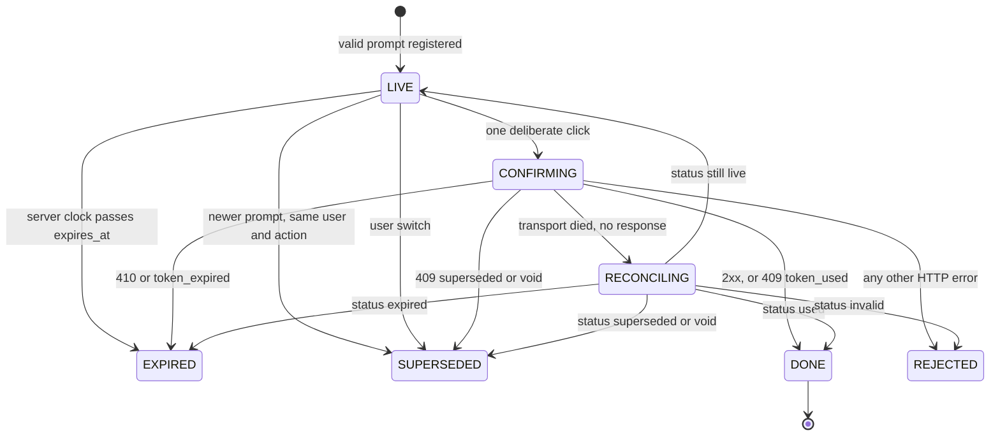

# Sofra client

React + TypeScript client for the Sofra assistant. It speaks the contract in the repository README and does not modify `mock-server/`, `data/`, `schema/`, `scripts/`, or `scenarios.jsonl`.

The mock is the source of truth for money, eligibility, and whether an action ran. This client streams UI, refuses to draw anything it cannot validate, and treats confirmation as a state machine that can fire at most once.

## Run

From the repository root, two terminals:

```bash
npm start          # mock on http://localhost:4000
npm run client     # Vite on http://localhost:5173, proxies /api → :4000
```

From `client/`: `npm run dev`, `npm run build`, `npm run test`, `npm run lint`.

Review walk, with the mock already running:

```bash
npm run walk              # all 24 rows, then the ledger assertions
npm run walk -- sc_05     # one row
npm run check -- sc_05    # ledger only, after a manual pass in the UI
npm run reset
```

`scripts/walk-scenarios.mjs` drives the HTTP contract the way a well-behaved client does. Focus, keyboard confirm, and the wallet update still need a pass in the browser (`sc_23`, rows 4–9).

## Where the dangerous decisions live

A later change should have to get these wrong in one place, not in a component.

| Decision | Owner |
|---|---|
| Bytes become events, duplicates are dropped, a dead stream stays incomplete | `infrastructure/streaming` |
| A block is either trusted or absent | `domain/ui-spec` (Zod, `.strict()`) |
| A token may be executed, and only once | `domain/confirmation` |
| “Now” for expiry and “today” | `domain/clock`, fed by `server_now` and `X-Sofra-Now` |
| Markdown cannot navigate, fetch, or run | `security/markdown` |
| Wallet, cart, and orders refresh after a real execution | `ConfirmationProvider` invalidates the shell queries |

React renders the result of those decisions. It does not make them.

## Architecture

```
app            providers, shell layout
features       chat, confirmation UI, shell, audit inspector
domain         ui-spec, confirmation store, server clock
infrastructure NDJSON session, fetch, execute/status
security       markdown policy
shared         user context, money formatting, primitives
```

Four pieces of state, on purpose:

1. **Chat turns** live in `useChatController`. A turn is a user line plus an assistant record: transport status, trusted blocks, validation failures, and the parsed audit record. The transcript is not derived from the raw stream.
2. **Confirmations** live in a store outside React (`createConfirmationStore`), subscribed with `useSyncExternalStore`. The store is the only caller of `POST /api/actions/execute`. The button asks the store to confirm a token; it does not call fetch.
3. **The server clock** is a module anchor: last `server_now` (or `X-Sofra-Now`) plus `performance.now()` elapsed since that sample. Expiry and relative dates never use `Date.now()`. The mock’s today is 2026-08-20 in Europe/Istanbul; the laptop clock would expire every prompt on sight.
4. **The shell** (wallet, cart, orders) is React Query, keyed by user id. Chat blocks are not a cache of those resources. After a successful execute, or after status reconciliation says the token was used, the store’s `onDone` invalidates user, cart, and orders for that user. The header moves 800 → 410 without a reload because the shell refetches, not because the client subtracts.

Switching user remounts the chat (`ChatSessionProvider key={userId}`), clears `conversation_id`, and marks that user’s live prompts `SUPERSEDED`. The next message starts a new conversation. The old token is not confirmable (`sc_24`).

## Streaming and rendering

`POST /api/chat` returns `application/x-ndjson`. Chunks are not lines and are not characters.

```
Uint8Array
  → TextDecoder({ stream: true })     split code points stay in the decoder
  → line buffer                       a line split across chunks parses once
  → JSON.parse                        a bad line is dropped; the turn continues
  → applyStreamEvent                  first seq wins; later copies are ignored
  → AssembledStream                   slots filled by index; text_delta appends
  → parseBlockList (Zod)              trusted blocks + failure records
  → BlockRenderer                     switches on TrustedBlock['type']
```

`createStreamSession` gives each turn a generation. `abort()` or a newer `beginTurn()` bumps it. Pushes from the old reader return immediately, so a stopped or replaced stream cannot paint into the next turn. Stop aborts the `fetch`. Sending while a turn is in flight aborts it first and marks that assistant turn `stopped` (“Replaced by a newer message”).

`meta.version` other than `"1"` freezes the assembly as `unsupported_version`. Later events do not render. The user sees a plain refusal, not a half-drawn catalog from a contract we do not implement.

If the body ends while status is still `streaming`, the turn is `incomplete`: whatever arrived stays, with a retry. `drop_mid_stream` destroys the socket; the read throws and we take the same path. If bytes simply stop after the first chunk and the socket stays open, a 2.5s idle timer cancels the reader and marks the turn incomplete. That timer is a client assumption; the spec’s incomplete rule is “no `done`”.

HTTP failures never become a fake stream:

- **429** reads `Retry-After`, disables send until that window passes, then the user retries. We do not auto-retry.
- **500** is a final failure for that attempt, with a retry that starts a new request.
- A network failure before any body is retryable. A network failure after partial bytes is the incomplete turn above.

`conversation_id` from `meta` is stored and sent on later turns. Follow-ups (“make it 5 cheeseburgers”) only work inside that conversation.

Unknown block types (`map_view`) are skipped. The rest of the turn renders. There is no empty hole and no crash.

## Validation

Runtime validation is Zod, written against the v1 catalog in `domain/ui-spec/blockSchemas.ts`, not generated from `schema/`. Generation would track the file; hand-written schemas make the closed set and the fail-closed cases obvious in review. The cost is drift: a catalog change must be copied here. I would generate them in CI if this catalog kept moving (see below).

Rules, in order:

1. A value that is not an object with a string `type` is an invalid block. It is not drawn.
2. A `type` outside the catalog is `unknown_type`. It is skipped. Siblings still render.
3. A known type is parsed with a discriminated union of `.strict()` objects. Extra keys fail the block. Zod’s default is to strip unknown keys and continue; stripping would render a block we do not fully understand, which is the wrong failure mode next to a confirmation token.
4. A `confirmation_prompt` that fails (missing `expires_at`, wrong `action`, empty token, extra fields) sets `rejectedConfirmation` and is **not** registered with the store. No Confirm control exists for that token, even when the token would have executed on the server (`malformed_confirmation`).
5. Only a successful parse produces a `TrustedBlock`. `BlockRenderer`’s switch is exhaustive on that union. The component cannot receive the raw JSON.

Empty index slots (a `text_delta` or a hole before its `block`) are dropped before this parse. Prices, fees, and `meets_minimum` are displayed as sent. The client does not add line items or invent a delivery fee.

Audit is parsed with the same strictness. A structurally invalid audit is omitted from the inspector; it does not sink the blocks that already validated. Validation failures for the turn are listed beside the audit record.

## Confirmation lifecycle

States: `LIVE → CONFIRMING → DONE`, and the exits `EXPIRED`, `SUPERSEDED`, `REJECTED`, `RECONCILING`.



Exactly once:

- `confirm()` returns immediately if the token is already in `inFlight` or not `LIVE`. A double click, a triple click, or a held activation cannot start a second `execute`.
- The Confirm control is `<button type="button">`. It is not focused when the prompt appears. Enter in the composer submits the form that sends a chat message. The hint under the composer says so. There is no path from that key to `confirm()`.
- A newer prompt for the same user and action marks older `LIVE` / `CONFIRMING` / `RECONCILING` entries `SUPERSEDED` before the new one is stored. The old button disables. The ledger should show zero attempts with the old token.
- `token_used` (409 after a duplicate that still raced) is `DONE`, not an error. The UI does not say “already used” after a success.
- A dropped execute response is `TransportError`. The store reconciles with `GET /api/actions/status` and does not ask for a second approval. `used` becomes `DONE` and renders `nextBlocks` from the status result, so a tip that actually landed is shown as landed (`drop_execute_response`).
- A 410 body can carry a fresh `confirmation_prompt`. Follow-up prompts inside a parsed execute body are registered. The expired card stays inert; the new one is the only live control.
- Expiry is evaluated against the server clock on a 1s tick and again at the start of `confirm()`. Without a clock sample, `canStartConfirm` is false. We do not guess with the laptop clock.

The card stays on screen after `DONE` (“Confirmed”) and renders the execute `nextBlocks` under it. `cancel_order` uses a destructive treatment (copy, border) so it is not the same object as place-order. A `verification_gate` is a different component: “Blocked — nothing executed”, no confirm control, requirement shown as text rather than colour.

The secondary control (“Not now” / “Keep order”) does not call the server. The contract has no dismiss endpoint, and a client-only hide would leave a live token. The control is disabled together with Confirm once the prompt is no longer `LIVE`. I would rather omit it than imply a void we cannot perform; see production notes.

## Untrusted content

`text.markdown` is model output that quotes user-controlled data. `order_summary.note` is a customer string. Neither is HTML.

| Surface | Policy |
|---|---|
| Assistant markdown | `react-markdown` with **no** `rehype-raw`. HTML in the source stays text. |
| Links | `urlTransform` allowlist: `http:`, `https:`, `mailto:` only. `javascript:` and `data:` become non-links. `http(s)` opens in a new tab with `rel="noopener noreferrer"`. |
| Images | Custom `img` renderer. The URL is never requested. The user sees an alt-text stub. |
| Order notes | React text children in the chat card and in the orders panel. Not passed through markdown. |

`react-markdown` will pass raw HTML through if `rehype-raw` is added later. It is not a dependency, and the image override ignores `src` so a future default change does not start fetching. `sc_17` (`html_in_note`, `javascript_link`, `remote_image`) is required to leave `security_beacons === 0`.

Suggested-action chips only call `send()` with the chip string. They cannot execute an action.

## Accessibility

Keyboard-only is the default path, not a later pass (`sc_23`).

- Skip link moves focus to the composer. Interactive controls use a `:focus-visible` ring.
- Confirm is in tab order and is never auto-focused.
- Gate, confirm, done, expired, replaced, and error each have a text label. Status is also border style (solid / dashed / dotted), not hue alone.
- The countdown is `aria-live="polite"`. A gate is `role="status"` with an explicit “nothing executed” label.
- Streaming text is one markdown block that grows. We do not announce each token. An empty text block reserves a “Thinking…” line so the layout does not jump when the first delta arrives.
- Money uses `tr-TR` / TRY formatting. Display strings that we case-fold use a locale (`en-US` on the status badge) so a Turkish `i` is not destroyed by a default `toUpperCase()`.

Screen-reader behaviour beyond that (a single polite announcement when a stream settles, naming the gate and the confirmation by role) is the bonus pass. It is not claimed as done.

## Audit inspector

Every assistant turn keeps `decision`, `reason`, `intent`, `tools_called`, `kb_doc_ids`, the request id, the turn status, and per-block validation failures, including rejected confirmations.

The inspector is the sidebar “Audit” section, for the reviewer. The product transcript does not repeat `audit.decision`. The user already sees the outcome: a gate, a confirmation card, or ordinary text. Putting `blocked` / `unknown` / `clarify` in the bubble would leak protocol vocabulary and compete with the block that already explains the situation. Row 18’s “I don’t know” stays a normal answer in chat; the inspector is where `unknown` vs `answered` (and `pol_delivery_fee_v2`) is visible.

## Assumptions

- The spec wins if it and the mock disagree. Nothing in this client depends on a mock behaviour that contradicts the README. Chaos modes are handled as the README describes them.
- Idle cutoff of 2.5s after the first byte is our reading of a stream that stops without `done` and without a clean close. A clean close takes the same incomplete path immediately.
- `token_used` is success. Showing an error there would punish the user for a duplicate we already tried to prevent.
- 429 is user-paced. Auto-retry would hide the `Retry-After` window and make a second attempt easy to fire early.
- Relative dates (“today”, “2 days ago”) use the server’s Istanbul calendar day, not the browser timezone.
- The secondary confirmation button is not a void. See the lifecycle section.

## Tests

The tests pin the behaviours that move money or paint the wrong turn. They are not snapshots.

| Area | File | What is pinned |
|---|---|---|
| Stream | `infrastructure/streaming/streamEngine.test.ts`, `infrastructure/api/apiClient.test.ts` | Split UTF-8, split lines, duplicate `seq`, missing `done`, error/`retryable`, abort and supersede leak nothing into the next turn |
| Confirmation | `domain/confirmation/confirmationStore.test.ts` | Single in-flight execute, expiry by server clock, supersede, transport failure reconciles once, invalid prompt never registers, `onDone` for shell refresh |
| Blocks | `domain/ui-spec/uiSpec.test.ts` | Unknown skipped, invalid not rendered, malformed confirmation fail-closed |
| Markdown | `security/markdown/SafeMarkdown.test.tsx` | HTML inert, `javascript:` not a link, image `src` not fetched |
| Clock | `domain/clock/serverClock.test.ts` | Anchor, countdown, Istanbul relative day |

## With more time, and what changes in production

Scope was cut from the bottom of the spec list. Keyboard behaviour was not cut. The bonus screen-reader script and a phone layout were.

Before I would ship this:

1. **Abort the chat fetch on unmount.** User switch remounts the session and clears `conversation_id`, and `clearUser` kills confirmability. A late `meta` from the old request can still call `setConversationId` on the parent, because that setter outlives the chat. An unmount `AbortController.abort()` closes that race. I would not call the user-switch path finished without it.
2. **Generate the Zod catalog from `schema/` in CI**, and keep `.strict()` plus the explicit “unknown type is skip, invalid confirmation is drop” policy in the generator’s tests. Hand-written schemas are readable for a weekend; they will drift.
3. **Drop the inert secondary button** until there is a real void, or make “Not now” only collapse the card locally while the countdown still expires the token. A control that looks like a decision and performs none is worse than no control.
4. **One announcement when a stream settles**, and an accessible name on the confirmation region that includes the action and the total. Token-by-token live regions would be the wrong fix.
5. **Content-Security-Policy** as a backstop for the markdown policy: no inline script, `img-src` not `*`. The renderer is the control; CSP is the second one.
6. **Multi-tab.** `inFlight` is per page. Two tabs can both be `LIVE` for one token. The server’s single-use token saves the money (`token_used` → `DONE`); the second tab should learn that from status rather than from a local set. A production client would subscribe to status, or hold a short lock, instead of trusting one memory.
7. **Persistence.** Refresh drops the transcript and the confirmation store. The server still holds the conversation and the token. I would reload the conversation and re-register only prompts that `GET /api/actions/status` still reports as `live`.
8. **Clock jumps.** We re-anchor on every `X-Sofra-Now` and every `meta.server_now`, which is what the spec requires after `POST /__admin/clock`. I would ignore a sample that moves backwards by more than a small skew, so a bad header cannot revive an expired token.
9. **Contract gaps I would ask for, not invent.** A dismiss/void for “Not now”. A stable idempotency key on execute distinct from the confirm token, so the client can retry a lost response without the status dance being the only tool. An explicit `ui_spec` error block when version is unsupported, instead of the client inventing the sentence. None of these are required to meet the current contract, and the client does not pretend they exist.
